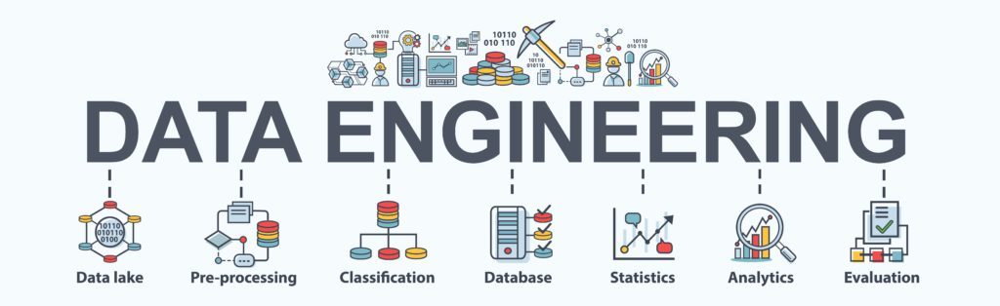

# *Extract, Transform, Load - ETL (Extrair, Transformar, Carregar)*

ETL são processos que têm por objetivo extrair dados de variados sistemas, 
fazer a sua transformação de acordo com a necessidade da empresa e, por fim, carregá-los em um lugar de armazenamento.

Por meio do ETL, é possível definir a qualidade dos dados e a forma como eles são manipulados a fim de transformá-los em uma informação inteligível e confiável.
O ETL também contribui para a criação e elaboração de relatórios relevantes para o planejamento estratégico de um negócio, 
ajudando a consolidar dados que podem servir como base em tomadas de decisões.

A primeira fase do processo é destinada à extração de dados dos seus sistemas originais.

Na segunda parte do processo, os dados são transformados e ajustados conforme a necessidade.
Sobre esses dados podem ser atribuídas diferentes regras que vão ajudar a melhorar a sua qualidade. 
O objetivo é levar para a análise apenas aquilo que será efetivamente aproveitado.

No terceiro e último passo do processo, é preciso fazer o carregamento dos dados já organizados em um novo repositório.

Os projetos depositados aqui são:

<a href="https://github.com/MichelinJV/E_T_L/blob/master/ETL_API_MySQL.ipynb">ETL_API_MySQL: </a>
Criar um pipeline ETL onde retiramos dados de um API da NASA sobre ejeção de massa coronal, transformamos e limpamos os dados em uma nova tabela e, 
por último, carregamos os dados no banco de dados MySQL.

<a href="https://github.com/MichelinJV/E_T_L/blob/master/ETL_with_MySQL.ipynb">ETL_with_MySQL: </a>
O objetivo é projetar um pipeline ETL que seja simples mas eficiente, onde criamos tabelas no MySQL com informações sobre os empregados de uma empresa, 
extraímos os dados do banco de dados, transformamos ou limpar os dados usando vários métodos do Pandas e carregamos os dados transformados ou limpos novamente no banco de dados MySQL.
